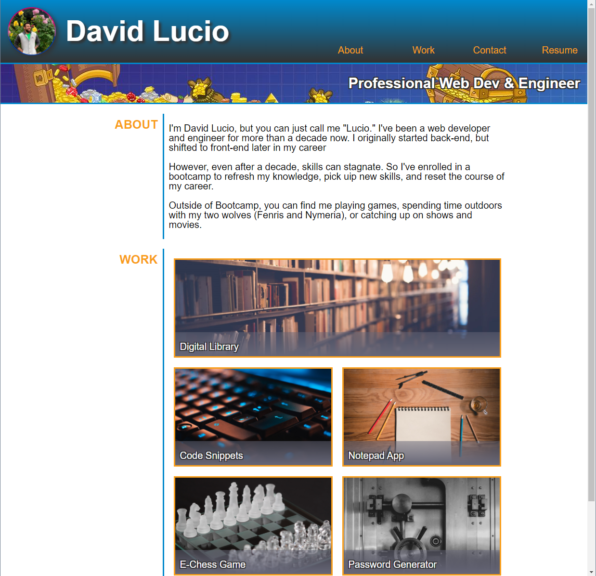

# professional-portfolio-mark1
## HW2 by David Lucio

First iteration of a professional portfolio for the UW Coding Bootcamp. Focus: HTML5 &amp; CSS3

 &nbsp;

*NOTE: I had issues with GitHub Pages when trying to publish this*

&nbsp;

**UW Bootcamp Homework 02**
Recreated the template portfolio using dummy links and stock images. Also used some of my personal resopurces and brand coloring as variables. For the most part, I tried to make it 1-to-1, but I took a few liberties with functionality.

&nbsp;

*Assignment completed 6/22*: [Deployment Link](https://davidlucio.github.io/professional-portfolio-mark1/)
### **Screenshot of completed project:**
