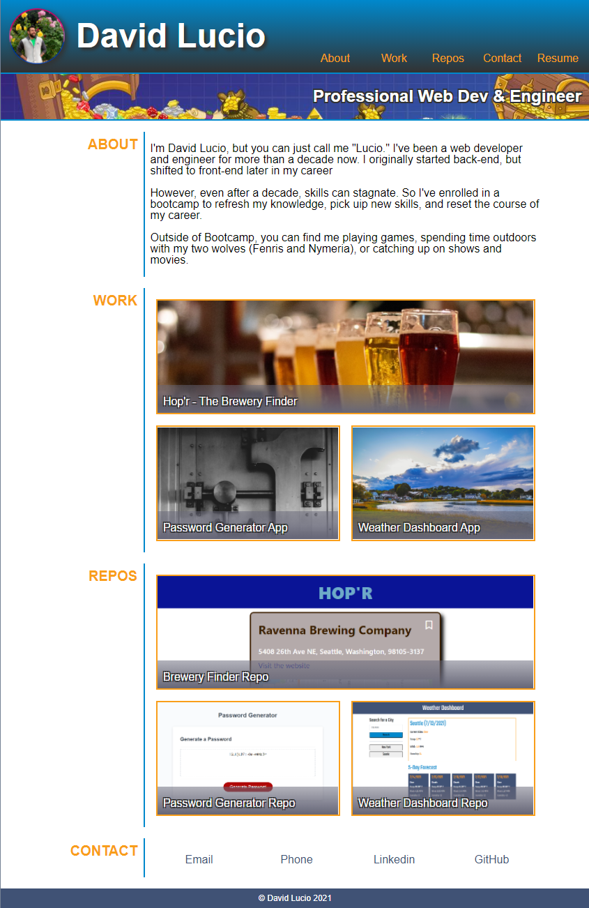

# professional-portfolio

## by David Lucio

&nbsp;

### **Professional portfolio for the UW Coding Bootcamp.**
*Focus: HTML5, CSS3, js/jQuery*

### **v2.0** (7/13/21)
>Updated portfolio template. Now includes updated links to various projects and repos, as well as screenshots, and a link to GitHub.

### **v1.0** (6/22/21)
 >Recreated template portfolio using dummy links and stock images. Also used some of my personal resopurces and brand coloring as variables. For the most part, I tried to make it 1-to-1, but I took a few liberties with functionality.

&nbsp;

*Assignment completed 7/13*: [Deployment Link](https://davidlucio.github.io/professional-portfolio/)
### **Screenshot of completed project:**
